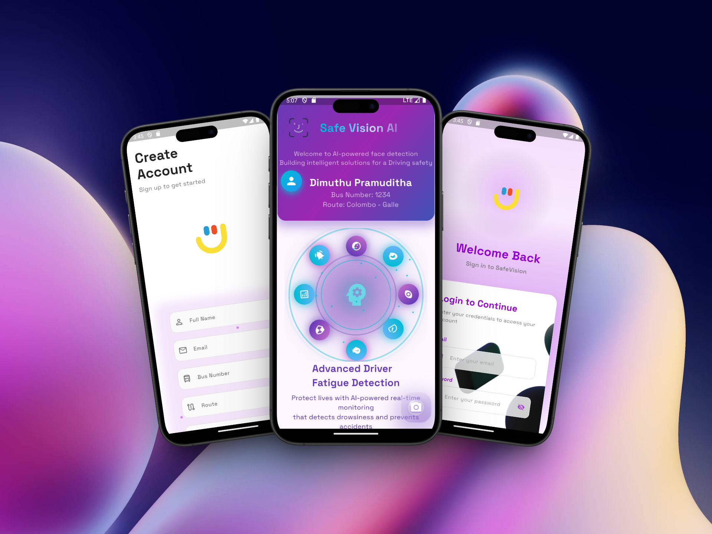
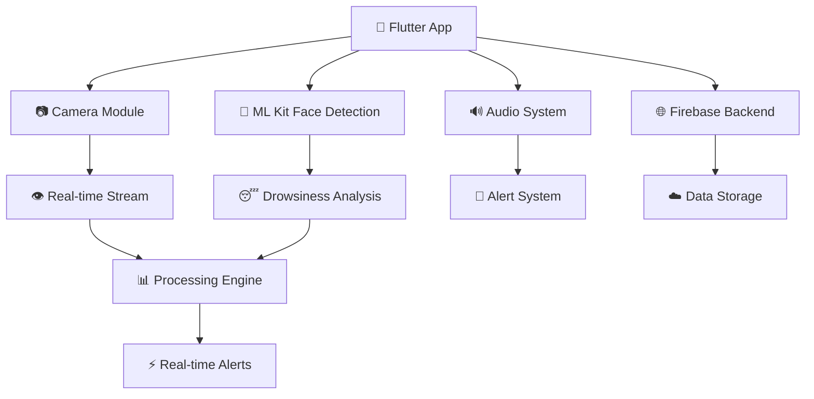

<div align="center">

# 👁️ SafeVision
### *AI-Powered Drowsiness Detection & Safety Monitoring*


[](https://flutter.dev/)
[](https://firebase.google.com/)
[](https://dart.dev/)
[](https://developers.google.com/ml-kit)

<p align="center">
  
</p>

*SafeVision is an intelligent Flutter application that uses advanced machine learning to detect drowsiness and fatigue in real-time, helping prevent accidents and promote safety.*

</div>

---

## 🌟 Features That Make SafeVision Special

<table>
<tr>
<td width="50%">

### 🎯 **Core Capabilities**
- 👁️ **Real-time Face Detection** - Advanced ML Kit integration
- 😴 **Drowsiness Monitoring** - Smart eye closure detection
- 🚨 **Instant Alerts** - Audio & haptic feedback
- 📊 **Blink Rate Analysis** - Fatigue level assessment
- 🎥 **Live Camera Feed** - Front-facing camera integration
- 📱 **Cross-platform** - iOS & Android support

</td>
<td width="50%">

### ⚡ **Smart Features**
- 🌤️ **Weather Integration** - Environmental monitoring
- 🗺️ **Location Services** - GPS tracking capability
- 🔊 **Audio Alerts** - Custom sound notifications
- 📈 **Session Analytics** - Detailed monitoring stats
- 🎨 **Animated UI** - Smooth, engaging interface
- 🔐 **Firebase Backend** - Secure data management

</td>
</tr>
</table>

---

## 🎬 Demo & Screenshots

<div align="center">

### 📱 **App Interface**

<p align="center">
  
</p>

*Real-time drowsiness detection in action - SafeVision monitoring interface*

</div>

---

## 🏗️ **Architecture & Tech Stack**

<div align="center">



</div>

### 🛠️ **Technologies Used**

<div align="center">

| Category | Technology | Purpose |
|----------|------------|---------|
| 🎨 **Frontend** | Flutter 3.7.2+ | Cross-platform UI |
| 🧠 **AI/ML** | Google ML Kit | Face detection & analysis |
| 📷 **Camera** | Camera Plugin | Real-time video capture |
| 🔊 **Audio** | AudioPlayers | Alert sound management |
| ☁️ **Backend** | Firebase | Authentication & storage |
| 🎬 **Animation** | Flutter Animate | Smooth UI transitions |
| 🎭 **Graphics** | Lottie | Complex animations |
| 🌍 **Location** | Geolocator | GPS services |

</div>

---

## 🚀 **Getting Started**

<div align="center">
  
</div>

### 📋 **Prerequisites**

Before you begin, ensure you have:

- ✅ **Flutter SDK** (3.7.2 or higher)
- ✅ **Dart SDK** (compatible version)
- ✅ **Android Studio** / **VS Code**
- ✅ **Firebase Account**
- ✅ **Physical Device** (for camera testing)

### 🔧 **Installation Steps**

1. **Clone the Repository**
   ```bash
   git clone https://github.com/DPramuditha/-SafeVision.git
   cd SafeVision
   ```

2. **Install Dependencies**
   ```bash
   flutter pub get
   ```

3. **Firebase Setup**
   ```bash
   # Add your firebase configuration files:
   # - android/app/google-services.json
   # - ios/Runner/GoogleService-Info.plist
   ```

4. **Environment Configuration**
   ```bash
   # Create .env file in root directory
   cp .env.example .env
   # Add your API keys and configuration
   ```

5. **Run the Application**
   ```bash
   flutter run
   ```

---

## ⚙️ **Configuration**

### 🔑 **Environment Variables**

Create a `.env` file in the project root:

```env
# Weather API (Optional)
WEATHER_API_KEY=your_weather_api_key_here

# Firebase Configuration (Auto-generated)
FIREBASE_PROJECT_ID=your_project_id
```

### 🔥 **Firebase Setup**

1. Create a new Firebase project
2. Enable **Authentication** and **Firestore**
3. Download configuration files
4. Place them in respective platform folders

---

## 📱 **Usage Guide**

<div align="center">

### 🎯 **How to Use SafeVision**

</div>

1. **🚀 Launch the App**
   - Open SafeVision on your device
   - Grant camera and microphone permissions

2. **👁️ Position Your Face**
   - Ensure good lighting conditions
   - Keep your face centered in the camera view

3. **▶️ Start Monitoring**
   - Tap the "Start Monitoring" button
   - The app begins real-time face detection

4. **📊 Monitor Your Status**
   - View live blink rate statistics
   - Check drowsiness indicators
   - Receive instant alerts when needed

5. **🛑 End Session**
   - Tap "Stop Monitoring" to end
   - Review your session statistics

---

## 🎨 **Key Components**

### 📷 **Face Detection Engine**

```dart
// Example: Initializing face detection
final options = FaceDetectorOptions(
  enableContours: true,
  enableClassification: true,
  enableTracking: true,
  performanceMode: FaceDetectorMode.fast,
  minFaceSize: 0.05,
);
_faceDetector = FaceDetector(options: options);
```

### 🚨 **Alert System**

```dart
// Example: Triggering fatigue alert
void _triggerFatigueAlert(String message) {
  HapticFeedback.heavyImpact();
  _playAlertSound();
  _showVisualAlert(message);
}
```

---

## 📊 **Features Deep Dive**

<details>
<summary>👁️ <strong>Eye Tracking & Analysis</strong></summary>

- **Real-time Eye Detection**: Uses ML Kit's face detection API
- **Blink Rate Calculation**: Monitors blinks per minute
- **Eye Closure Duration**: Detects prolonged eye closure
- **Fatigue Scoring**: Advanced algorithms assess tiredness levels

</details>

<details>
<summary>🚨 <strong>Alert Mechanisms</strong></summary>

- **Visual Alerts**: Screen overlays and animations
- **Audio Alerts**: Customizable alarm sounds
- **Haptic Feedback**: Vibration patterns
- **Progressive Alerting**: Escalating alert intensity

</details>

<details>
<summary>📈 <strong>Analytics & Reporting</strong></summary>

- **Session Tracking**: Monitor usage patterns
- **Blink Statistics**: Detailed blink analysis
- **Alert History**: Track alert frequency
- **Performance Metrics**: App performance monitoring

</details>

<details>
<summary>🌍 <strong>Smart Integrations</strong></summary>

- **Weather Data**: Environmental context
- **Location Services**: GPS-based features
- **Firebase Sync**: Cloud data synchronization
- **Cross-platform**: iOS and Android support

</details>

---

## 🧪 **Testing**

### 🔬 **Running Tests**

```bash
# Run unit tests
flutter test

# Run integration tests
flutter test integration_test/

# Run with coverage
flutter test --coverage
```

### 📱 **Device Testing**

- **Physical Device Required**: Camera functionality needs real hardware
- **iOS Testing**: Requires iOS 11.0+
- **Android Testing**: Requires API level 21+

---

## 🤝 **Contributing**

<div align="center">
  
</div>

We welcome contributions! Here's how you can help:

### 🎯 **Ways to Contribute**

- 🐛 **Bug Reports**: Found an issue? Let us know!
- ✨ **Feature Requests**: Have ideas? Share them!
- 🧹 **Code Improvements**: Submit PRs for enhancements
- 📚 **Documentation**: Help improve our docs
- 🧪 **Testing**: Help us test on different devices

### 📝 **Contribution Process**

1. **Fork** the repository
2. **Create** a feature branch (`git checkout -b feature/AmazingFeature`)
3. **Commit** your changes (`git commit -m 'Add some AmazingFeature'`)
4. **Push** to the branch (`git push origin feature/AmazingFeature`)
5. **Open** a Pull Request

---

## 📄 **License**

This project is licensed under the **MIT License** - see the [LICENSE](LICENSE) file for details.

---

## 🙏 **Acknowledgments**

<div align="center">

### 💖 **Special Thanks To**

- **Google ML Kit Team** - For powerful face detection APIs
- **Flutter Team** - For the amazing framework
- **Firebase Team** - For reliable backend services
- **Open Source Community** - For inspiration and support

</div>

---

## 📞 **Contact & Support**

<div align="center">

### 🤔 **Need Help?**

<p align="center">
  <a href="mailto:your-email@example.com">
    
  </a>
  <a href="https://github.com/DPramuditha/-SafeVision/issues">
    
  </a>
  <a href="https://github.com/DPramuditha/-SafeVision/discussions">
    
  </a>
</p>

</div>

---

<div align="center">

### 🌟 **Star This Repository**

<p align="center">
  
</p>

**If SafeVision helped you stay safe, please consider giving it a ⭐!**

<p align="center">
  <i>Made with ❤️ and lots of ☕ by the SafeVision Team</i>
</p>

<p align="center">
  
  
</p>

---

<sub>🚗 **Drive Safe, Stay Alert, Use SafeVision!** 🚗</sub>

</div>
